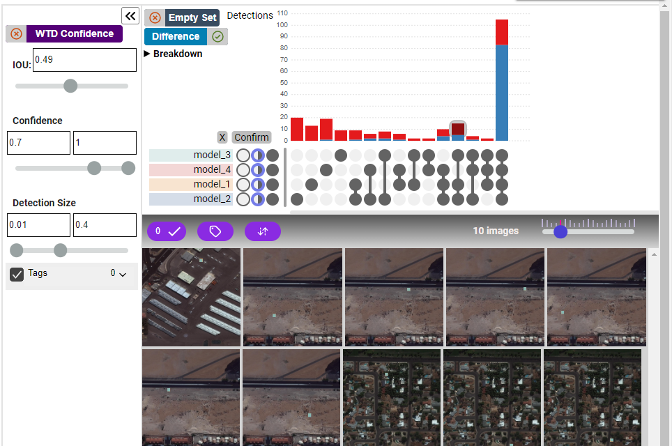

# Introduction

**SetMLVis** is an innovative interactive visualization system designed for use within Jupyter notebooks. It facilitates the comparison of different object detection models, addressing the limitations of aggregate metrics and the visual clutter inherent in multiple image detections. This system adopts a unique approach by comparing models at the detection level. Utilizing a set visualization inspired by Upset ([Upset](https://upset.app/)), SetMLVis intelligently matches detections across various models, effectively pre-processing data into insightful slices. This method shows the distinct strengths and weaknesses of each model.

Interested in learning more? Visit our [GitHub page](https://github.com/VisDunneRight/setmlvis). For a hands-on experience, explore the [Getting Started](./getting_started.md) section or try our introductory [Colab notebook](https://colab.research.google.com/drive/1-tuGJ9RpCm3ROBjUD2lHiRK2H9Tgoc6V?usp=sharing).
## Project Status

SetMLVis is currently in its initial release phase. We welcome feedback and encourage users to report issues via our [GitHub Issues page](https://github.com/VisDunneRight/setmlvis). For direct assistance, please contact the project maintainers.

## Project Maintainers

- Liudas Panvas: [Profile](https://lpanavas.github.io/#/)
- Tarik Crnovrsanin: [Profile](https://www.tarikc.net/)
